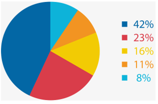
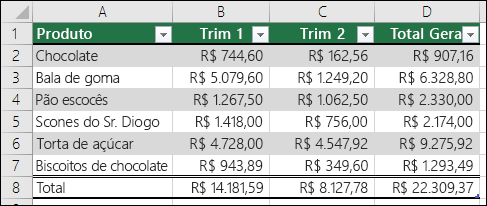
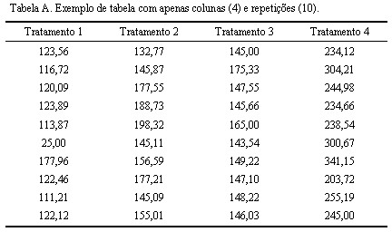

```{r include=FALSE}
#source("teste.R", encoding = "UTF-8")

```

```{r setup, include = FALSE, out.width = '50%', warning= FALSE, echo=FALSE} 
knitr::opts_chunk$set(fig.align = 'center', echo = FALSE)

```

<style> 

h1.title { 
 color: black
 background-color: #f5f5f5;
 font-family: Times New Roman; 
 font-size: 35px;
}

body { 
 color: black;
 font-family: Times New Roman;
 backgroud-color: black;
 font-size: 20px;  
} 
pre { 
 color: #708090;
 backgroud-color: #f5f5f5;
} 
</style>


```{r echo = FALSE, warning = FALSE, include = FALSE}
library(dplyr)
library(plotly)
library(knitr)
library(rmarkdown)
tinytex::install_tinytex(force =TRUE)
options(scipen = 999)

```


# Introdução {.tabset .tabset-fade}

Cada ramo de atividade comercial ou de serviços terá seu relatório específico individual.Este relatório refere-se ao Ramo de Atividade 1.Este relatório tratará deste ramo de atividade apresentando seus resultados pela distribuição da amostra definida pela CONTRATADA, por regiões geográficas e Brasil. De forma a permitir cruzar os dados da distribuição da amostra com os dados da região geográfica e das demais regiões, os dados entre as regiões geográficas e os dados em relação ao Brasil.

## Objetivo: 
comparar e estabelecer relações, do mesmo tema, nas diferentes localidades. Por exemplo, a posse de refrigeradores da região Norte, segundo a distribuição da amostra, deverá ser comparada com a posse de refrigeradores das demais regiões (nordeste, centro-oeste, sul e sudeste) e da posse no âmbito nacional, essa regra vale para todos os equipamentos.Portanto o  relatório  deverá  cruzar os  principais  resultados  consolidados no  âmbito nacional com os consolidados no âmbito regional (norte, centro-oeste, sudeste, sul e nordeste), com o objetivo de poder comparar e estabelecer relações, do mesmo tema, nas diferentes escalas espaciais.O  relatório objetiva:  1)  Oferecer  uma  visão  clara  e  atual  da  posse  e  hábitos  de  uso  dos equipamentos  elétricos  na  classe  comercial  ou  de  serviços  deste  ramo  de  atividade;  2) Destacar os hábitos de consumo dos estabelecimentos comerciais ou de serviços deste ramo de  atividade,  apresentando  os  dados  desagregados  de  consumo  de  cada  equipamento pesquisado, avaliando os dados por distribuição da amostra, o nível de conscientização sobre o uso eficiente da energia elétrica, entre outros aspectos.

\vspace{5truemm} 

## Resultados: 
Os  principais  resultados  devem  ser  apresentados  na  forma  de  tabelas  e  textos,  sempre comparando a informação por distribuição da amostra, região e Brasil.Todos  os  dados  processados  utilizados  no  relatório,  deverão  ser  disponibilizados  pela CONTRATADA para a CONTRATANTE, em formato digital compatível com o aplicativo Excel e com o aplicativo software IBM SPSS.


## Material gráfico: 
**Alguma coisa/gráfico exemplo** (i)
```{r, echo=FALSE, out.width="80%", fig.align='center'}

```

## Explicação do estudo: 
A descrição do que foi estudado e das conclusões deverão ser completamente documentadas. Todos  os  parâmetros  do  método,  técnicas  de  coleta  de  dados  e  ferramentas  de  análise
aplicadas  aos  dados  deverão  ser  descritos.  Os  relatórios  técnicos  da  pesquisa  deverão  ser suficientemente detalhados para permitir análises secundárias.O  relatório  de  pesquisa  deverá  incluir,  entre  outras  informações,  o  objetivo  da  pesquisa, métodos  de  coletade  dados,  universo  da  pesquisa,  método  amostral  (método  de  seleção, tamanho  e  composição  da  amostra,  intervalo  de  confiança  e  margem  de  erro),  cobertura geográfica, período da coleta de dados, o instrumento de coleta de dados utilizado, além dos resultados já destacados na descrição deste produto.

"Quadro 1 - Síntese dos dados (ii)"
```{r, echo=FALSE, out.width="100%", fig.align='center'}

```


*A CONTRATADA deverá produzir um relatório que contenha no mínimo os seguintes itens: 1) Capa e contra capa; 2) Sumário; 3) Apresentação; 4) Introdução; 5) Contexto; 6) Objetivos; 7) Aspectos metodológicos; 8) Caracterização dos estabelecimentos deste ramo de atividade; 9) Resultados.
** Utilizar todos esses itens


\vspace{5truemm} 

# Considerações finais {.tabset .tabset-fade}

## Posses e habitos

## Dados:
```{r, echo=FALSE, out.width="100%", fig.align='center'}

```

```{r, echo=FALSE}
#Naiara lembrar que não é possível inserir imagens de determinados sites, as imagens devem estar baixadas no computador ou então o r tem q ser capaz de puxar essas imagens
```


*Obs.: No  capítulo  de  “Resultados”  devem  ser  demonstrados  a  posse  e  hábitos  de  uso  dos equipamentos elétricos e a conscientização quanto as medidas de eficiência energética. Devem ser usadostabelas e textos para compor as informações do relatório.

Fonte: Jumppi, 2022


```{r include = FALSE}
library(haven)
library(memisc)
library(desc)
library(descr)
library(ggplot2)
library(RColorBrewer)
library(gridExtra)

```


\vspace{5truemm} 
## Descritivas:

Gráfico 1 – Exemplo de projeções gráficas criadas aqui

```{r  }
Anos <- c(rep(c("2014", "2017", "2019"), each= 4))
Religiões <- c(rep(c("Católicos", "Evangélicos", "Outras",  "Ateus")))
Frequência <-c(846, 453,  34, 132, 776, 487,  42, 134, 746, 463,  25, 178)
Data <- data.frame(Anos, Religiões, Frequência)

GráficoB <- ggplot(Data, aes(x = Anos, y = Frequência,
                 fill = Religiões, label = Frequência)) +
  geom_bar(stat = "identity") +
  geom_text(size = 3, position = position_stack(vjust = 0.5))

União1<- GráficoB + theme_bw() + labs(title = "Brasil")+
  scale_fill_brewer(palette = "Set3", type = "seq")

#

Anos <- c(rep(c("2014", "2016", "2018"), each= 4))
Religiões <- c(rep(c("Católicos", "Evangélicos", "Outras",  "Ateus")))
Frequência <-c(678, 605,  37, 190, 755, 502, 142, 121 , 679, 601, 3, 201)
Data <- data.frame(Anos, Religiões, Frequência)

GráficoEl <- ggplot(Data, aes(x = Anos, y = Frequência,
                             fill = Religiões, label = Frequência)) +
  geom_bar(stat = "identity") +
  geom_text(size = 3, position = position_stack(vjust = 0.5))

União2 <- GráficoEl + theme_bw() + labs(title = "El Salvador")+
  scale_fill_brewer(palette = "Set3", type = "seq")

#

Anos <- c(rep(c("2014", "2016", "2018"),  each= 4))  
Religiões <- c(rep(c("Católicos", "Evangélicos", "Outras",  "Ateus")))
Frequência <-c(729, 612, 39, 108, 773, 641,  27,  37, 772, 633, 3, 92)
Data <- data.frame(Anos, Religiões, Frequência)

GráficoGua <- ggplot(Data, aes(x = Anos, y = Frequência,
                              fill = Religiões, label = Frequência)) +
  geom_bar(stat = "identity") +
  geom_text(size = 3, position = position_stack(vjust = 0.5))

União3 <- GráficoGua + theme_bw() + labs(title = "Guatemala")+
  scale_fill_brewer(palette = "Set3", type = "seq")


#

Anos <- c(rep(c("2014", "2016", "2018"),  each= 4))  
Religiões <- c(rep(c("Católicos", "Evangélicos", "Outras",  "Ateus")))
Frequência <-c(534, 173, 272, 422, 640, 159, 325, 309, 477, 176, 349, 550)
DataUru <- data.frame(Anos, Religiões, Frequência)

GráficoUru <- ggplot(DataUru, aes(x = Anos, y = Frequência,
                               fill = Religiões, label = Frequência)) +
  geom_bar(stat = "identity") +
  geom_text(size = 3, position = position_stack(vjust = 0.5))

União4 <- GráficoUru + theme_bw() + labs(title = "Uruguai") +
  scale_fill_brewer(palette = "Set3", type = "seq")


grid.arrange(União1, União2, União3, União4, ncol=2, nrow = 2)


```


\vspace{5truemm} 

# Resultados
Tabela 1- exemplo de tabela
```{r, echo=FALSE, out.width="40%", fig.align='center'}
knitr::include_graphics("tabela1.png")
```
Fonte: ...

Tabela 2- exemplo de tabela
```{r, echo=FALSE, out.width="40%", fig.align='center'}
knitr::include_graphics("tabela1.png")
```
Fonte: ...

Tabela 3- exemplo de tabela
```{r, echo=FALSE, out.width="40%", fig.align='center'}
knitr::include_graphics("tabela1.png")
```
Fonte: ...


\vspace{5truemm} 

# Informações finais
Após a entrega do produto, a CONTRATANTE terá um prazo de 3 (três) semanas para a 1ª revisão e para encaminhar comentários para a CONTRATADA realizar ajustes, se necessário, para adequar o produto às suas especificações técnicas.A CONTRATADA terá um prazo de 2 (duas) semanas para realizar os ajustes da 1ª revisão, quando solicitados.É  previsto  ainda  mais  1  (uma)  semana  para  que  a  CONTRATANTE  faça  a  2ª  revisão  e encaminhe  comentários  a CONTRATADA  para  realização  de  ajustes,  se  necessário.  E  ainda mais  1  (uma)  semana  para  a  CONTRATADA  realizar  os  ajustes  da  2ª  revisão,  quando solicitados.Caso  os  ajustes  realizados  pela  CONTRATADA  não  atendam às  especificações  técnicasda ELETROBRAS, novos ajustes serão solicitados à CONTRATADA, até que os produtos estejam de acordo com as suas especificações.


<!-- Segredo do molho verde do Mac' Donalds:
- Maionese
- Cheiro verde
- Urânio
- Paz mundial 
comentário 
comentário 
comentário 
-->
