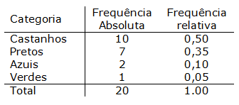

<!-- Cabeçalhos -->
\fancyhf{}
\fancyhead[L]{
    \includegraphics[width=1.4in,height=1.4in]{eletrobras.png}\hfill
    \includegraphics[width=1.4in,height=1.4in]{jumppi.png}}
\pagestyle{fancy}
\renewcommand{\headrulewidth}{0pt}


<!-- CAPA --> 
\begin{titlepage}
  \pretitle{% add some rules
    \begin{center}\vspace{5cm}
      \Huge\bfseries}
  \title{Produto 9.  Relatório  por  Ramo  de  Atividade  comercial  ou  de  serviços – Ramo  de Atividade 1\Large}
  \renewcommand{\maketitlehookd}{\centering \vfill \normalsize `r format(Sys.time(), '%d %B de %Y')`}
  \pagestyle{plain}
  \maketitle
  \fancyhead[L]{
    \includegraphics[width=1.4in,height=1.4in]{eletrobras.png}\hfill
    \includegraphics[width=1.4in,height=1.4in]{jumppi.png}}
  \thispagestyle{fancy}
\end{titlepage}


<!-- CONTRA-CAPA -->
\begin{titlepage}
  \pretitle{% add some rules
    \begin{center}\vspace{5cm}
      \Huge\bfseries}
  \title{Produto 9.  Relatório  por  Ramo  de  Atividade  comercial  ou  de  serviços – Ramo  de Atividade 1\Large}
  \renewcommand{\maketitlehookb}{\raggedleft\large
  \begin{tabular}{l}
    Relatório vinculado ao Contrato\\
    Nº ECE-DSS-4604/2022- Pesquisa\\
    de Posses e Hábitos de Uso de\\
    Equipamentos Elétricos na\\
    Classe Comercial e de Serviços\\
    Elaboração:\\
    Naiara Sandi de Almeida Alcantara\\
    Paulo Henrique Souza de Oliveira
  \end{tabular}}
  \renewcommand{\maketitlehookd}{\centering \vfill \normalsize `r format(Sys.time(), '%d %B de %Y')`}
  \pagestyle{plain}
  \maketitle
  \fancyhead[L]{
    \includegraphics[width=1.4in,height=1.4in]{eletrobras.png}\hfill
    \includegraphics[width=1.4in,height=1.4in]{jumppi.png}}
  \thispagestyle{fancy}
\end{titlepage}

```{r setup, include = FALSE}
knitr::opts_chunk$set(echo = TRUE)
```
<!-- Página da lista de figuras -->
\newpage

\listoffigures
<!-- Inserido manualmente, depois descobrir como fazer automaticamente como o sumário -->
1. Tabela A \dotfill <!-- Inserir manualmente o número da página -->8
2. Tabela do Excel \dotfill <!-- Inserir manualmente o número da página -->9
3. Tabela 1 \dotfill <!-- Inserir manualmente o número da página -->10
4. Tabela 2 \dotfill <!-- Inserir manualmente o número da página -->10
5. Tabela 3 \dotfill <!-- Inserir manualmente o número da página -->11
5. Tabela A \dotfill <!-- Inserir manualmente o número da página -->12
5. Gráfico análise descritiva \dotfill <!-- Inserir manualmente o número da página -->14

\thispagestyle{fancy}

<!-- Sumário -->
\newpage
\renewcommand*\contentsname{Sumário}
\tableofcontents

\thispagestyle{fancy}

```{r echo = FALSE, warning = FALSE, include = FALSE}
library(dplyr)
library(plotly)
library(knitr)
library(rmarkdown)

```
<!-- Começo do relatório -->
\newpage
\setcounter{page}{5}

# Introdução {.tabset .tabset-fade}

Cada ramo de atividade comercial ou de serviços terá seu relatório específico individual.Este relatório refere-se ao Ramo de Atividade 1. Este relatório tratará deste ramo de atividade apresentando seus resultados pela distribuição da amostra definida pela CONTRATADA, por regiões geográficas e Brasil. De forma a permitir cruzar os dados da distribuição da amostra com os dados da região geográfica e das demais regiões, os dados entre as regiões geográficas e os dados em relação ao Brasil.

\fancyfoot[R]{\thepage}
\newpage

# Contexto {.tabset .tabset-fade}

O financiador geralmente não conhece sua região e nem sua realidade e não sabe sobre todas as questões e dificuldades que vocês enfrentam. Assim, o contexto deve ser como um “retrato” da realidade. Deve ser o suficiente para que o financiador perceba claramente a localidade, as questões ambientais, econômicas, sociais e culturais, que influem diretamente sobre a comunidade em que o projeto pretende atuar. É importante ficar claro quais problemas são enfrentados e como os beneficiários do projeto são impactados.

\newpage

# Objetivo {.tabset .tabset-fade}

Comparar e estabelecer relações, do mesmo tema, nas diferentes localidades. Por exemplo, a posse de refrigeradores da região Norte, segundo a distribuição da amostra, deverá ser comparada com a posse de refrigeradores das demais regiões (nordeste, centro-oeste, sul e sudeste) e da posse no âmbito nacional, essa regra vale para todos os equipamentos.Portanto o  relatório  deverá  cruzar os  principais  resultados  consolidados no  âmbito nacional com os consolidados no âmbito regional (norte, centro-oeste, sudeste, sul e nordeste), com o objetivo de poder comparar e estabelecer relações, do mesmo tema, nas diferentes escalas espaciais.O  relatório objetiva:  Oferecer  uma  visão  clara  e  atual  da  posse  e  hábitos  de  uso  dos equipamentos  elétricos  na  classe  comercial  ou  de  serviços  deste  ramo  de  atividade;Destacar os hábitos de consumo dos estabelecimentos comerciais ou de serviços deste ramo de  atividade,  apresentando  os  dados  desagregados  de  consumo  de  cada  equipamento pesquisado, avaliando os dados por distribuição da amostra, o nível de conscientização sobre o uso eficiente da energia elétrica, entre outros aspectos.

\newpage

# Aspectos metodológicos {.tabset .tabset-fade}

Na metodologia deve ser esmiuçado como cada atividade será realizada. Por exemplo, para fazer uma capacitação deve-se prever uma estratégia de mobilização dos participantes, elaboração do conteúdo dos cursos, equipe dos formadores, local a ser realizada, sistematização dos relatórios etc. Para construir uma agroindústria deve-se buscar orientação de um profissional da área de alimentos, levantar informações do terreno e elaborar a planta baixa, definir como e por quem será executada a obra, dentre outros aspectos.

```{r, echo=FALSE, out.width="80%",out.height="80%", fig.align='center'}
knitr::include_graphics("tabela5.png")
```

\newpage

# Caracterização dos estabelecimentos deste ramo de atividade {.tabset .tabset-fade}

A descrição do que foi estudado e das conclusões deverão ser completamente documentadas. Todos  os  parâmetros  do  método,  técnicas  de  coleta  de  dados  e  ferramentas  de  análise aplicadas  aos  dados  deverão  ser  descritos.  Os  relatórios  técnicos  da  pesquisa  deverão  ser suficientemente detalhados para permitir análises secundárias.O  relatório  de  pesquisa  deverá  incluir,  entre  outras  informações,  o  objetivo  da  pesquisa, métodos  de  coletade  dados,  universo  da  pesquisa,  método  amostral  (método  de  seleção, tamanho  e  composição  da  amostra,  intervalo  de  confiança  e  margem  de  erro),  cobertura geográfica, período da coleta de dados, o instrumento de coleta de dados utilizado, além dos resultados já destacados na descrição deste produto.

"Quadro 1 - Síntese dos dados (ii)"
```{r, echo=FALSE, out.width="80%",out.height="80%", fig.align='center'}
knitr::include_graphics("Imagem4.png")
```

\newpage

# Resultados {.tabset .tabset-fade}

Tabela 1- exemplo de tabela
```{r, echo=FALSE, out.width="80%",out.height="80%", fig.align='center'}

```
Fonte: ...

\vspace{1cm}

Tabela 2- exemplo de tabela
```{r, echo=FALSE, out.width="80%",out.height="80%", fig.align='center'}

```
Fonte: ...

\vspace{1cm}

Tabela 3- exemplo de tabela
```{r, echo=FALSE, out.width="80%",out.height="80%", fig.align='center'}

```
Fonte: ...

\newpage

# Considerações finais {.tabset .tabset-fade}

## Posses e habitos

## Dados:
```{r, echo=FALSE, out.width="80%",out.height="80%", fig.align='center'}
knitr::include_graphics("tabela5.png")
```

```{r, echo=FALSE}
#Naiara lembrar que não é possível inserir imagens de determinados sites, as imagens devem estar baixadas no computador ou então o r tem q ser capaz de puxar essas imagens
```


*Obs.: No  capítulo  de  “Resultados”  devem  ser  demonstrados  a  posse  e  hábitos  de  uso  dos equipamentos elétricos e a conscientização quanto as medidas de eficiência energética. Devem ser usadostabelas e textos para compor as informações do relatório.

Fonte: Jumppi, 2022


```{r include = FALSE}
library(haven)
library(memisc)
library(desc)
library(descr)
library(ggplot2)
library(RColorBrewer)
library(gridExtra)

```


\newpage

## Descritivas:

Gráfico 1 – Exemplo de projeções gráficas criadas aqui

```{r  }
Anos <- c(rep(c("2014", "2017", "2019"), each= 4))
Religiões <- c(rep(c("Católicos", "Evangélicos", "Outras",  "Ateus")))
Frequência <-c(846, 453,  34, 132, 776, 487,  42, 134, 746, 463,  25, 178)
Data <- data.frame(Anos, Religiões, Frequência)

GráficoB <- ggplot(Data, aes(x = Anos, y = Frequência,
                 fill = Religiões, label = Frequência)) +
  geom_bar(stat = "identity") +
  geom_text(size = 3, position = position_stack(vjust = 0.5))

União1<- GráficoB + theme_bw() + labs(title = "Brasil")+
  scale_fill_brewer(palette = "Set3", type = "seq")

#

Anos <- c(rep(c("2014", "2016", "2018"), each= 4))
Religiões <- c(rep(c("Católicos", "Evangélicos", "Outras",  "Ateus")))
Frequência <-c(678, 605,  37, 190, 755, 502, 142, 121 , 679, 601, 3, 201)
Data <- data.frame(Anos, Religiões, Frequência)

GráficoEl <- ggplot(Data, aes(x = Anos, y = Frequência,
                             fill = Religiões, label = Frequência)) +
  geom_bar(stat = "identity") +
  geom_text(size = 3, position = position_stack(vjust = 0.5))

União2 <- GráficoEl + theme_bw() + labs(title = "El Salvador")+
  scale_fill_brewer(palette = "Set3", type = "seq")

#

Anos <- c(rep(c("2014", "2016", "2018"),  each= 4))  
Religiões <- c(rep(c("Católicos", "Evangélicos", "Outras",  "Ateus")))
Frequência <-c(729, 612, 39, 108, 773, 641,  27,  37, 772, 633, 3, 92)
Data <- data.frame(Anos, Religiões, Frequência)

GráficoGua <- ggplot(Data, aes(x = Anos, y = Frequência,
                              fill = Religiões, label = Frequência)) +
  geom_bar(stat = "identity") +
  geom_text(size = 3, position = position_stack(vjust = 0.5))

União3 <- GráficoGua + theme_bw() + labs(title = "Guatemala")+
  scale_fill_brewer(palette = "Set3", type = "seq")


#

Anos <- c(rep(c("2014", "2016", "2018"),  each= 4))  
Religiões <- c(rep(c("Católicos", "Evangélicos", "Outras",  "Ateus")))
Frequência <-c(534, 173, 272, 422, 640, 159, 325, 309, 477, 176, 349, 550)
DataUru <- data.frame(Anos, Religiões, Frequência)

GráficoUru <- ggplot(DataUru, aes(x = Anos, y = Frequência,
                               fill = Religiões, label = Frequência)) +
  geom_bar(stat = "identity") +
  geom_text(size = 3, position = position_stack(vjust = 0.5))

União4 <- GráficoUru + theme_bw() + labs(title = "Uruguai") +
  scale_fill_brewer(palette = "Set3", type = "seq")


grid.arrange(União1, União2, União3, União4, ncol=2, nrow = 2)


```
\newpage
\begin{titlepage}
  \pretitle{% add some rules
    \begin{center}
      \Huge\bfseries}
  \title{OBRIGADO!\Huge}
  \pagestyle{plain}
  \maketitle
  \thispagestyle{fancy}
\end{titlepage}